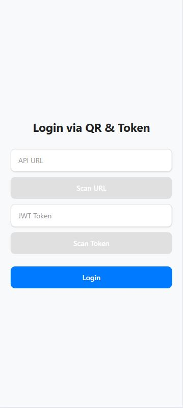
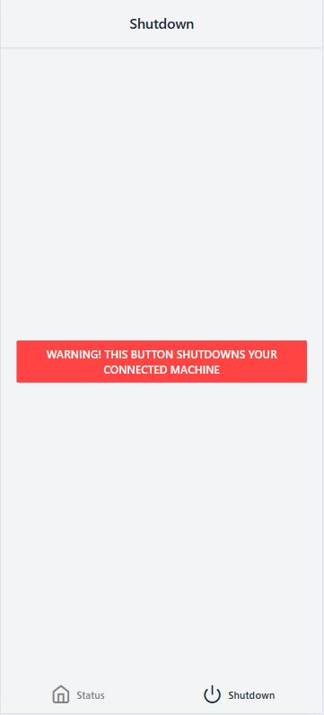

# Remote Access App via React Native App and python Backend

This is a small self-built tool that lets me remotely check the status of my PC and shut it down via a React Native app. Just to learn more about APIs, JWT authentication, and backend/frontend interaction and python.
The project combines a Python backend with a React Native frontend and exposes everything securely via a Cloudflare tunnel. I wanted to explore how to scan QR codes to log in, how to protect endpoints with tokens, and how to avoid CORS issues by using a simple proxy.
I had this idea a few years ago and finally took the time to build it. This project helped me dive deep into backend/frontend communication, JWT auth, and secure remote access.

> [!NOTE]
> It’s not meant to be production-grade.


---

## 🚀 Features

### 🔒 Secure Remote Control

* **JWT Token Authentication**: Only clients with a valid JSON Web Token (JWT) can access protected endpoints.
* **Cloudflare Tunnel Integration**: Easily expose localhost to the internet through a secure tunnel.

### ⚙️ Backend Services

* **Quick Tunnel Startup**: Automatically starts a local server at `http://localhost:8000` and exposes it via `cloudflared`.
* **System Monitoring**: Query current machine resource usage (CPU, memory, etc.).
* **Shutdown Command**: Remotely shut down the machine with a single button.

### 📱 React Native Mobile App

* **API Login**: Scan QR codes for API URL and JWT token to connect securely.
* **Home Tab**: Display live system resource data.
* **Shutdown Tab**: One-tap remote shutdown.

---

## 💡 Use Case

This project was built as a personal project to deepen the understanding of frontend-backend communication, token-based authentication, and remote access APIs.

The main idea: I wanted to remotely shut down my home PC from my phone - securely and with a bit of style. I used this opportunity to gain hands-on experience with:

- JSON Web Tokens (JWT)
- Dynamic backend tunnels using Cloudflare
- QR code-based login workflows
- React Native communication via a proxy Node server
- Python coding

While it solves a specific small task (remote shutdown and machine resources requests), the real value for me lies in the architecture and technologies used to make it work.


---

## ⚙️ Tech Stack

### 🔧 Backend

* **Python 3** – REST API with endpoint handling and JSON Web Token authentication
* **FastAPI** – Provides REST endpoints: `GET /status`, `POST /shutdown`, `GET /qr`
* **Bash Scripting** – Automates environment setup and cloudflared tunnel management
* **cloudflared** – Establishes a secure tunnel to `localhost:8000`

### 📱 Frontend

* **React Native** – Cross-platform mobile app interface
* **Expo Go** – Quick deployment and testing on Android/iOS devices
* **Node.js Proxy Server** – Handles CORS by forwarding frontend requests to the backend

---

## 🧩 Setup Process

### Step 1: Backend Setup

1. **Run `install_cloudflared.sh`**

   * Creates a Python virtual environment
   * Installs requirements
   * Installs `cloudflared`
   * Starts a Cloudflare tunnel to `http://localhost:8000`
   * Extracts the tunnel URL
   * Generates QR codes:

     * For the URL via `generate_qr_code.py`
     * For the JWT via `setup.py`
   * Starts the backend: `backend/main.py`
   * Starts a Node.js server to forward frontend requests and avoid CORS issues

### Step 2: React Native App

1. Start the app on a physical device using **Expo Go**
2. On the **Login Screen**:

   * Enter (or scan) the **Cloudflare URL** and **JWT Token**
   * Press **Login** to authenticate
3. Access the **Home Tab** to monitor resources
4. Use the **Shutdown Tab** to turn off the connected machine

> [!NOTE]
> Small caveat: The proxy server in `node-server/index.js` (used to avoid CORS issues) currently forwards to a hardcoded local backend address (`http://192.168.2.30:3000`).
> I didn’t bother with full config parsing for this small tool.


---

## 🔧 Future Ideas

- **Access from Anywhere**:  
  Since the backend is already exposed via a secure Cloudflare tunnel, it’d be good to tweak the proxy so the app works even when I’m not at home.


---


## 🖼️ Screenshots

| Screenshot              | Description                                                                        |
| ----------------------- | ---------------------------------------------------------------------------------- |
|  | **Login Screen** – Enter or scan the API URL and JWT token to log in.              |
|  | **Home Tab** – Displays system resource usage like CPU and memory stats.           |
|  | **Shutdown Tab** – Allows secure shutdown of the connected PC with a button press. |

---

## 📂 Project Structure

```
RemoteAccessApp/
├── backend/
│   ├── main.py                                   # FastAPI backend providing REST endpoints
│   ├── auth.py                                   # JWT token generation and validation
│   └── shutdown.py and system_info.py            # System status and shutdown helpers
├── frontend/
│   └── App.js              # React Native mobile app code
├── node-server/
│   └── index.js            # CORS proxy between frontend and backend
├── scripts/
│   ├── install_cloudflared.sh  # Installs dependencies, starts tunnel and backend
│   ├── generate_qr_code.py     # QR code for Cloudflare URL
│   └── setup.py                # Generates JWT and QR code
├── requirements.txt        # Python dependencies
└── README.md               # Project overview
```

---

## 🧑‍💻 Author

Built with ❤️ to provide simple and secure remote machine access, developed as a learning and utility project for remote IT control.
